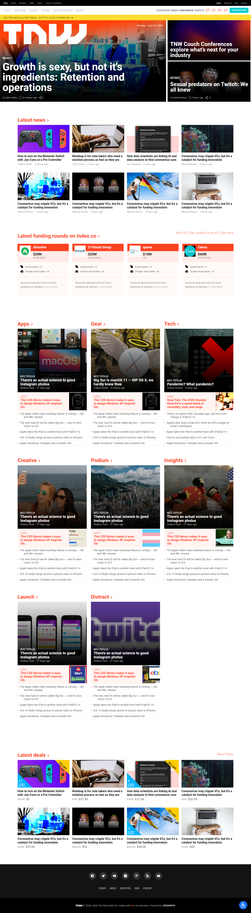

# Smashing Magazine Replica

> One paragraph statement about the project.

Additional description about the project and its features.

## Live Demo

[Live Demo Link](https://condescending-saha-4e8669.netlify.app/)

## Built With

- HTML5
- CSS3

## Getting Started

**Open index.html in the browser**

## Authors

:bust_in_silhouette: **@DejazmachMolla**

- Github: [@dejazmachMolla](https://github.com/DejazmachMolla)
- Twitter: [@twitterhandle](https://twitter.com/DJATSS)
- Linkedin: [linkedin](https://www.linkedin.com/in/dejazmach-getachew-027aabaa/)

:bust_in_silhouette: **@m15e**

- Github: [@m15e](https://github.com/m15e)

## Show your support

Give a ⭐️ if you like this project!

## Acknowledgments

- Microverse
- [https://thenextweb.com/](https://thenextweb.com/)

## 📝 License

This project is [MIT](lic.url) licensed.